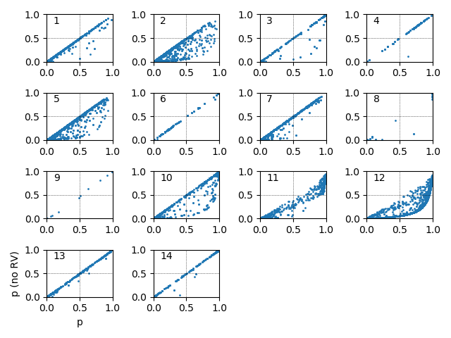

Compute component overlaps for two cases: One where stars have known radial velocities, and one where all stars have assigned radial velocities 0 and their errors are 1e+5.
Compare membership probabilities to see if we can still retrieve RV-less members, and whether there are any false positives. What is the false negative ratio?

# Results
There is absolutely no false positives.

False negatives:
First number is the number of false negatives. The number in brackets is ratio between the false negatives and true positives.
Component 1: 11 (0.074); total N of true positives: 149
Component 2: 69 (0.375); total N of true positives: 184
Component 3: 15 (0.044); total N of true positives: 342
Component 4: 1 (0.009); total N of true positives: 117
Component 5: 51 (0.105); total N of true positives: 485
Component 6: 0 (0.000); total N of true positives: 52
Component 7: 8 (0.021); total N of true positives: 390
Component 8: 2 (0.022); total N of true positives: 92
Component 9: 1 (0.028); total N of true positives: 36
Component 10: 48 (0.139); total N of true positives: 346
Component 11: 43 (0.102); total N of true positives: 421
Component 12: 684 (0.520); total N of true positives: 1315
Component 13: 1 (0.004); total N of true positives: 255
Component 14: 3 (0.016); total N of true positives: 182

